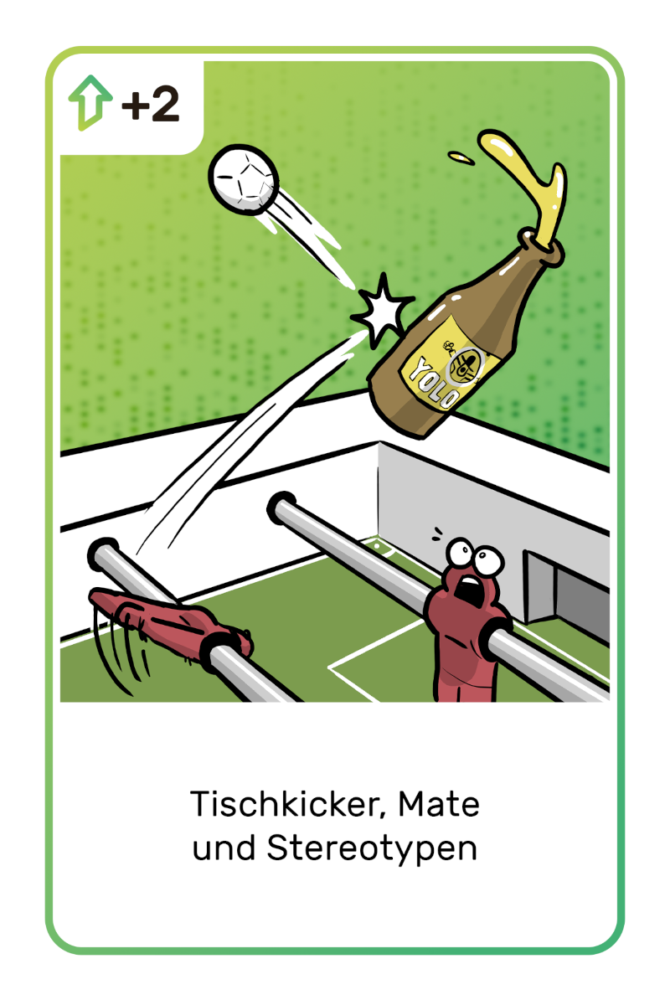

# Introduction to Agile Unicorn

## Objective of the Game

**Survive the IT chaos with your startup and be the first to win the most victory points.**

To beat your opponents, you must effectively use the potential of your development team in duels for new stories and the best minds. Unfortunately, things rarely go as planned, as the other players will also be using their possible means to secure the best stories for themselves.

!!! success "Winner"
    The winner is the player who is the first to reach the agreed number of victory points.

## Game Process

The game consists of several rounds (sprints): A sprint consists of up to 5 duel rounds (pitches). During a sprint, players try to outperform each other by playing their team and event cards to win the most valuable new cards for their startup.

!!! info "TLDR"
    Team members are secretly assigned cards that grant victory points. The team members have different strengths (dice). Effects cards can be played before and after rolling to gain an advantage. The team with the highest dice result wins the story victory point card.

## The Cards

There are four different types of cards. They are differentiated by their card color. For the rules, the card texts are not important; only the numbers and symbols in the top left matter.

### Stories (Victory Points)

{ align=right width=20% }

Stories have a value between 3 and 20 victory points. It corresponds to the number in the top left of the card.

Whether a story can be successfully implemented is determined by rolling dice against the value. On success, the player with the highest dice result receives the story card and places it face up at the end of the sprint next to their other won story cards.

### Team Members

{ align=right width=20% }

You can only win cards with team members. Their strength is shown in the top left by dice symbols. This indicates the number of dice you may roll when pitching for a story. Some cards also show a bonus or penalty below the dice.

Your team can consist of a maximum of 5 members. If a 6th member is won, the player must dismiss another member of their choice and place it under the draw pile.

The team members remain in hand until they are used. This is possible once per team member per sprint.

### Incentives

{ align=right width=20% }

Incentives can be used after rolling to improve the result.

The attractiveness of your startup is increased through perks that are meant to motivate team members to peak performance. Each card can be used once per sprint after rolling to improve the dice result, starting with the starting player. After use, they are placed face down until the end of the sprint.

### Event Cards

{ align=right width=20% }

Event cards have a one-time effect before rolling and can only be used by players against other players.

There is no limit to the number of event cards in hand and they can be collected over multiple rounds. After being played, they are consumed and placed under the event card pile.

!!! warning "Important"
    Players who pass cannot use event cards. Each card can be played against any player in the pitch (who hasn't passed), including yourself. They cannot be played against the pitch card in the center of the table to modify it.

## Symbols

| Effect           | Symbol                                                | Description                                                                                                                                                                                                                                                                                                                                                                                                                                                                    |
|------------------|-------------------------------------------------------|--------------------------------------------------------------------------------------------------------------------------------------------------------------------------------------------------------------------------------------------------------------------------------------------------------------------------------------------------------------------------------------------------------------------------------------------------------------------------------|
| Point Value      |                   | Bonus or penalty on the rolled result.                                                                                                                                                                                                                                                                                                                                                                                                                                         |
| Skip             |                        | The player must immediately take all placed team cards back into their hand. The team cards can continue to be used in the next pitch, but played event cards are lost. Event cards that are still in hand can be played (e.g. magic wand or "draw team member" to still use individual team members).                                                                                                                                                                         |
| Magic Wand       |                  | Cancels the effect of another event card once. The card can be played at any time, even against other magic wand cards.                                                                                                                                                                                                                                                                                                                                                        |
| Dice             |                   | One-time addition or reduction of the shown dice in the pitch.                                                                                                                                                                                                                                                                                                                                                                                                                 |
| Add Team Member  |          | The targeted player must use an additional team card in the pitch. This card must come from their hand and is selected by them.                                                                                                                                                                                                                                                                                                                                                |
| Remove Team Member |    | The targeted player must remove an already played team card of their choice from the pitch. This team card may only be taken back into hand in the next sprint.

